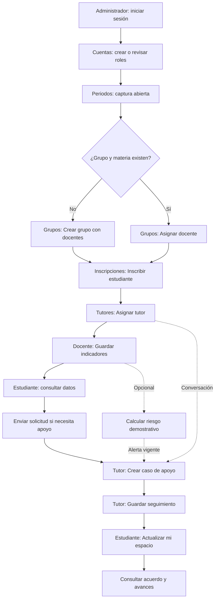

# Configurar la escuela y usar MESSI en línea

Entra a [MESSI en línea](https://messi-escolar-a3524110303.streamlit.app/)
con una cuenta de administrador. El espacio **ORGANIZACIÓN ESCOLAR** contiene
las pestañas **Cuentas**, **Periodos**, **Grupos**, **Inscripciones** y
**Tutores**. Toda esta configuración se realiza dentro de la misma aplicación.

## Cuenta, rol y asignación

Crear una cuenta permite iniciar sesión; su rol determina el espacio que ve.
Las asignaciones determinan qué personas y registros aparecen en ese espacio.
Por eso, una cuenta con rol **Docente** puede entrar y todavía mostrar que no
tiene grupos asignados.

| Configuración | Qué habilita |
| --- | --- |
| Cuenta con rol Docente | Entrada al espacio del docente |
| Docente asignado a un grupo y materia | Consulta y captura de los estudiantes inscritos en ese grupo |
| Cuenta con rol Estudiante y código escolar | Entrada al espacio personal del estudiante |
| Inscripción de un estudiante a un grupo y materia | El estudiante aparece en la lista de ese grupo y puede consultar sus indicadores |
| Cuenta con rol Tutor | Entrada al espacio del tutor |
| Tutor asignado a un estudiante en un periodo | Solicitudes, acuerdos y seguimiento de ese estudiante en ese periodo |

Cada grupo pertenece a una **materia y un periodo**. Comprueba los tres datos
al seleccionar una asignación. La inscripción y la tutoría son operaciones
independientes de la creación de cuentas.

## Flujo completo

El análisis es opcional: una solicitud o una conversación permiten acordar
apoyo aunque no exista una predicción. La puntuación procede de un modelo
demostrativo entrenado con datos sintéticos; el tutor revisa el contexto antes
de decidir las acciones de apoyo.

## Asignar la cuenta existente MarcoOsorio

MarcoOsorio ya tiene rol de docente. El paso pendiente es asignarle el grupo y
materia que realmente le corresponden.

1. Entra con el **administrador**. En **Cuentas**, escribe `MarcoOsorio` en
   **Buscar cuenta** y comprueba que aparece como **Docente** y activa.
2. Abre **Grupos** y busca la sección **Asignar docente a un grupo existente**.
3. Si hace falta, usa **Buscar grupo existente**. En **Grupo existente**,
   selecciona el grupo, la materia y el periodo que corresponden a
   MarcoOsorio. Esa selección depende de la organización de la escuela.
4. En **Buscar docente para asignar**, escribe `MarcoOsorio`. En
   **Docente a asignar**, elige su cuenta, comprobando el usuario que aparece
   entre paréntesis.
5. Pulsa **Asignar docente**. Esta operación agrega al docente y conserva los
   demás docentes que ya pertenecen al grupo. Comprueba su cuenta en la tabla
   **Grupos y docentes asignados**.
6. Si sus estudiantes todavía no están inscritos, abre **Inscripciones**,
   selecciona **Estudiante a inscribir** y **Grupo y materia de inscripción**,
   y pulsa **Inscribir estudiante** por cada estudiante que corresponda.
7. Entra con MarcoOsorio y pulsa **Actualizar mi espacio** en la barra lateral.
   Selecciona el grupo en **Grupo y materia**; sus estudiantes inscritos
   aparecerán en **Captura y análisis**.

Si el grupo y materia aún no existen, usa **Crear grupo y materia** dentro de
**Grupos**: completa **Nombre del grupo**, **Materia** y **Periodo del grupo**,
usa **Buscar docente para el grupo** si hace falta, selecciona a MarcoOsorio
en **Docentes del grupo** y pulsa **Crear grupo**.
El periodo debe existir con **Captura abierta**. Después continúa con las
inscripciones. Un grupo ya creado se reutiliza mediante **Asignar docente**.

## Orden de configuración del administrador

1. **Cuentas:** crea las cuentas individuales que falten mediante **Crear
   cuenta** y **Rol de la cuenta nueva**. Para un estudiante, completa
   **Código de estudiante** con `EST-` y de 3 a 8 dígitos; para los demás roles,
   deja ese código vacío. La cuenta y el registro del estudiante se crean
   juntos.
2. **Periodos:** completa nombre y fechas, activa **Captura abierta** y pulsa
   **Crear periodo**. Comprueba la columna **Captura** de la tabla.
3. **Grupos:** crea el grupo con su materia, periodo y docentes, o asigna el
   docente al grupo existente. **Crear grupo** ofrece periodos abiertos.
   También puedes asignar un docente a un grupo existente de un periodo
   cerrado para que consulte sus registros; la captura permanece cerrada.
4. **Inscripciones:** selecciona al estudiante y su grupo/materia; pulsa
   **Inscribir estudiante**. Repite para las inscripciones que correspondan.
5. **Tutores:** elige **Estudiante que recibirá tutoría**, **Tutor asignado** y
   **Periodo de la tutoría**; pulsa **Asignar tutor**. El estudiante debe estar
   inscrito en ese periodo. Si ya tenía otro tutor en ese periodo, esta
   operación reasigna la tutoría y sus casos al tutor elegido.

## Recorrido de docente, estudiante y tutor

1. **Docente:** selecciona **Grupo y materia** y abre **Captura y análisis**.
   Elige **Estudiante de esta página**, captura **Calificación** de 0 a 10,
   **Asistencia (%)** y **Tareas entregadas (%)** de 0 a 100, y pulsa
   **Guardar indicadores**. Si deseas usar el modelo, pulsa después
   **Calcular riesgo demostrativo**: el cálculo utiliza los valores guardados.
2. **Estudiante:** consulta **Mis indicadores**. Si necesita apoyo, abre
   **Mis solicitudes**, selecciona **Periodo escolar**, escribe su solicitud
   y pulsa **Enviar solicitud**. En **Mi acompañamiento** consulta los acuerdos
   y avances publicados.
3. **Tutor:** revisa **Solicitudes** o **Alertas**. En **Acordar apoyo**, elige
   **Origen del apoyo**: **Solicitud**, **Alerta vigente** o **Conversación**.
   Selecciona el registro correspondiente, completa **Acuerdo de apoyo visible
   al estudiante** y pulsa **Crear caso de apoyo**.
4. **Tutor:** en **Seguimiento**, usa **Abrir caso de esta página**, escribe
   **Avance y próximos pasos visibles al estudiante**, elige **Estado del
   caso** y pulsa **Guardar seguimiento**. Las notas privadas del tutor y del
   avance se conservan en su espacio; el estudiante ve el acuerdo y el avance.
5. **Estudiante:** pulsa **Actualizar mi espacio** y revisa
   **Mi acompañamiento** para consultar los cambios guardados.

Cada persona accede con su propia cuenta. Para cambiar de cuenta en el mismo
navegador, usa **Cerrar sesión** y vuelve a iniciar sesión. La opción
**Actualizar mi espacio** consulta los cambios compartidos que ya se guardaron.
