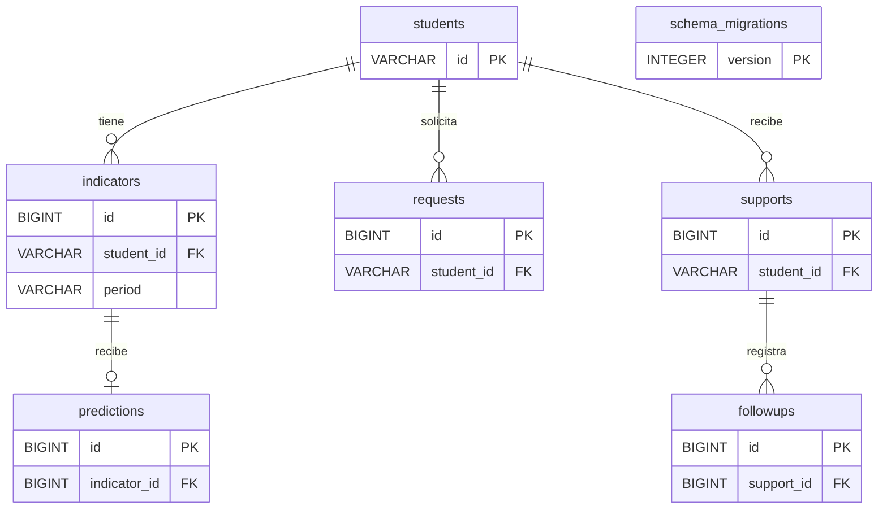

# Base de datos MySQL de MESSI

El runtime de MESSI utiliza MySQL para conservar estudiantes, indicadores,
predicciones, solicitudes, apoyos y seguimientos. Los datos viven en el servidor
MySQL configurado; no en una base SQLite creada por la interfaz.

`src/messi/esquema_mysql.sql` define las tablas y sus relaciones.
`src/messi/database.py` implementa configuración y transacciones;
`src/messi/mysql_storage.py` implementa `MySQLStore`.
`scripts/init_database.py` prepara explícitamente el esquema. El almacenamiento
`SupportStore` de `src/messi/storage.py` se mantiene como implementación SQLite
legada, fuente de migración y recurso de pruebas; la aplicación no vuelve a
SQLite cuando falla MySQL.

Esta guía corresponde al proyecto `C:\Users\user\Desktop\MESSI`. La migración
descrita importa únicamente un SQLite anterior de MESSI.

## Requisitos y configuración local

Se necesita un servidor MySQL 8.0.16 o posterior disponible, las dependencias de
`requirements.txt` y una cuenta autorizada para acceder a la base. El servicio
local puede aparecer en Windows como `MySQL80`. Tener el servicio iniciado no
demuestra que existan el usuario, la base o el esquema de MESSI.

Desde la raíz del proyecto, crea la configuración sólo si aún no existe:

```powershell
if (-not (Test-Path '.env')) { Copy-Item '.env.example' '.env' }
```

Completa `.env` con la contraseña real de la cuenta de aplicación. La plantilla
no contiene credenciales reales y `.env` está excluido de Git.

| Variable | Valor predeterminado | Uso |
| --- | --- | --- |
| `MESSI_MYSQL_HOST` | `127.0.0.1` | Dirección del servidor. |
| `MESSI_MYSQL_PORT` | `3306` | Puerto TCP de MySQL. |
| `MESSI_MYSQL_USER` | `messi` | Cuenta de aplicación. |
| `MESSI_MYSQL_PASSWORD` | Sin contraseña suministrada | Completar localmente. |
| `MESSI_MYSQL_DATABASE` | `messi` | Base existente a utilizar. |

El runtime utiliza la cuenta configurada y no selecciona un administrador por
defecto. Las variables de entorno permiten configurar una instalación distinta;
no hace falta cambiar ni publicar contraseñas en el código.

## Crear la base y la cuenta de aplicación

Un administrador de MySQL crea la base una vez:

```sql
CREATE DATABASE IF NOT EXISTS messi
    CHARACTER SET utf8mb4 COLLATE utf8mb4_unicode_ci;
```

Después crea la cuenta de aplicación con el administrador de cuentas de MESSI,
para que sus permisos se gestionen mediante roles:

```powershell
.\.venv\Scripts\python.exe scripts\manage_mysql_users.py create messi --role editor --admin-user root
```

El comando solicita las contraseñas del administrador y de la cuenta nueva en
la terminal. Completa `.env` con la contraseña elegida para `messi`, no con la
administrativa. La cuenta se limita al equipo local y a la base `messi`; recibe
`SELECT`, `INSERT`, `UPDATE` y `DELETE` mediante el rol editor, sin privilegios
globales.

Si la cuenta ya existe, revisa sus permisos antes de intentar crearla de nuevo.
El administrador puede mantenerla o preparar una cuenta nueva gestionada por
roles. No necesitas cambiar la autenticación del servidor.

Como alternativa manual, el SQL siguiente crea una cuenta con los mismos
permisos mínimos **directos**. Sustituye la contraseña de ejemplo antes de
ejecutarlo; no uses esta alternativa junto con `create` para la misma cuenta:

```sql
CREATE USER 'messi'@'127.0.0.1'
    IDENTIFIED BY 'REEMPLAZAR_POR_UNA_CONTRASENA_LOCAL';

GRANT SELECT, INSERT, UPDATE, DELETE
    ON messi.* TO 'messi'@'127.0.0.1';
```

Los permisos directos deben retirarse antes de usar `set-role` sobre esa cuenta;
la herramienta rechaza ese cambio mientras existan privilegios ajenos a sus
roles. Se recomienda crear las cuentas con el script para poder modificar sus
permisos posteriormente. La sintaxis SQL está documentada en
[GRANT de MySQL 8.0](https://dev.mysql.com/doc/refman/8.0/en/grant.html).

## Inicializar el esquema

La creación de tablas es una operación separada del arranque de la aplicación.
La cuenta de ejecución sólo necesita `SELECT`, `INSERT`, `UPDATE` y `DELETE`.
Para inicializar con esa misma cuenta, un administrador concede temporalmente:

```sql
GRANT CREATE, INDEX, REFERENCES
    ON messi.* TO 'messi'@'127.0.0.1';
```

Ejecuta desde la carpeta del proyecto:

```powershell
.\.venv\Scripts\python.exe scripts\init_database.py
```

Al terminar correctamente, el administrador retira los permisos temporales:

```sql
REVOKE CREATE, INDEX, REFERENCES
    ON messi.* FROM 'messi'@'127.0.0.1';
```

También se puede ejecutar el inicializador con una cuenta autorizada para crear
el esquema, usando las variables de entorno sólo para ese proceso. No guardes
esa cuenta como configuración habitual de la interfaz. La separación entre
permisos de datos y de definición del esquema corresponde a los
[privilegios de MySQL](https://dev.mysql.com/doc/refman/8.0/en/privileges-provided.html).

El comando habitual requiere que la base configurada exista. Si se desea crearla
desde el script, esa operación debe pedirse explícitamente y ejecutarse con una
cuenta que tenga el permiso correspondiente:

```powershell
.\.venv\Scripts\python.exe scripts\init_database.py --create-database
```

Crear una base no crea automáticamente una cuenta ni le concede permisos.
El inicializador registra la versión del esquema en `schema_migrations`.
El runtime comprueba esa versión mediante una consulta; no ejecuta DDL ni
requiere permisos para crear tablas al arrancar.

## Permisos del equipo bajo control del administrador

De momento, todas las personas que utilizan esta interfaz acceden mediante la
cuenta configurada de la aplicación y pueden usar la base. El administrador
puede crear cuentas individuales de MySQL, asignar permisos de lectura o
edición y bloquear o habilitar accesos desde `scripts/manage_mysql_users.py`.

| Rol del servidor | Permisos en la base configurada |
| --- | --- |
| `lector` | `SELECT`. |
| `editor` | `SELECT`, `INSERT`, `UPDATE` y `DELETE`. |

Las cuentas nuevas usan `editor` por defecto y no reciben permisos para crear
tablas, conceder privilegios ni administrar el servidor. El script solicita la
contraseña administrativa en la terminal sin mostrarla. Al crear una cuenta
pide también su nueva contraseña y confirmación. No se incluyen contraseñas en
los comandos ni se necesita compartirlas en un chat.

Ejemplos para una cuenta nueva de prueba, autorizados y ejecutados por el
administrador:

```powershell
.\.venv\Scripts\python.exe scripts\manage_mysql_users.py create integrante_demo --role editor
.\.venv\Scripts\python.exe scripts\manage_mysql_users.py set-role integrante_demo --role lector
.\.venv\Scripts\python.exe scripts\manage_mysql_users.py block integrante_demo
.\.venv\Scripts\python.exe scripts\manage_mysql_users.py unblock integrante_demo
.\.venv\Scripts\python.exe scripts\manage_mysql_users.py list
```

El administrador puede seleccionar su cuenta con `--admin-user`; `root` es el
valor predeterminado exclusivo de esta herramienta administrativa. El origen de
las cuentas creadas es `127.0.0.1` por defecto y puede elegirse explícitamente con
`--user-host`. Esto no configura automáticamente acceso remoto ni publica el
servidor.

El cambio de rol administra los roles de MESSI. La herramienta rechaza
`set-role` si la cuenta tiene privilegios directos u otros roles, para evitar
anunciar una restricción que no se cumpliría. El administrador debe revisar y
retirar esos permisos antes del cambio; puede consultar
`SHOW GRANTS FOR 'messi'@'127.0.0.1'`. La herramienta también protege la cuenta
administradora frente a modificaciones del equipo.

Estos son permisos del servidor MySQL. El selector Docente/Tutor/Estudiante de
la interfaz sigue siendo demostrativo y no identifica ni autentica a cada
integrante. Cambiar o bloquear la cuenta compartida afecta a todas las personas
que utilizan esa configuración; para restricciones individuales deben usar
cuentas diferentes. Las conexiones existentes deben cerrarse antes de dar por
comprobado un cambio de acceso.

## Relaciones y datos conservados



Los códigos de estudiantes son seudónimos, con el mismo contrato que utiliza
la validación de MESSI. Las solicitudes y los apoyos se asocian al estudiante;
cada seguimiento pertenece a un apoyo. Una solicitud no exige una predicción ni
que el modelo esté instalado.

`indicators` tiene una fila por estudiante y periodo, y `predictions` admite
como máximo una predicción por registro de indicadores. Estas tablas almacenan
el estado vigente, no un historial de todos los cambios y cálculos. Las claves
foráneas mantienen las relaciones mediante InnoDB; las restricciones `CHECK`
comprueban rangos de indicadores y riesgo, tipos de apoyo y estados permitidos.

El docente guarda los indicadores validados con **Guardar indicadores** y los
recupera con **Cargar indicadores guardados**. Importar Excel, CSV, una tabla
pegada o captura directa coloca los datos en la sesión hasta que se guardan.
La primera versión utiliza el periodo `primer_parcial`.

Guardar nuevos valores para el mismo estudiante y periodo sustituye los
indicadores anteriores. Si cambiaron los valores, se elimina su predicción
anterior para no mostrar un riesgo calculado sobre otros datos. El guardado de
una predicción rechaza resultados calculados antes de un cambio en esos
indicadores; hay que recargar y volver a calcular.

Al calcular una predicción se intenta conservar el resultado en MySQL. Si la
persistencia falla, la aplicación mantiene el resultado en la sesión y muestra
que no se guardó. El tutor puede recuperar los indicadores y las predicciones
persistidos cuando no hay datos cargados en esa sesión. Un cálculo visible en la
interfaz no es, por sí solo, evidencia de una escritura confirmada.

Las solicitudes y notas de acompañamiento se mantienen fuera de las variables
de entrada del modelo. La base conserva información del flujo escolar; no
entrena por sí misma la red neuronal ni modifica calificaciones.

## Importar el SQLite anterior de MESSI

La migración es opcional y explícita. Primero inicializa el esquema MySQL y
confirma que el archivo fuente corresponde a MESSI. Cierra Streamlit y detén
otras escrituras al destino y al SQLite de origen durante la importación y
comprobación de conteos:

```powershell
.\.venv\Scripts\python.exe scripts\migrate_sqlite.py --source data\private\messi.sqlite3
```

Si se omite `--source`, se utiliza `data/private/messi.sqlite3`. El importador
abre el archivo en modo de lectura y conserva el original. No necesita iniciar
Streamlit ni el modelo.

Importa las tablas legadas `requests`, `supports` y `followups`, y establece sus
relaciones con estudiantes. No importa indicadores o predicciones que nunca se
guardaron en el SQLite anterior; tampoco convierte archivos de otros proyectos.

Las tres tablas de destino deben estar vacías antes de la primera importación,
para evitar mezclar identificadores. La escritura en MySQL se realiza dentro de
una transacción y el marcador de migración de versión 2 se confirma junto con los
datos. Una ejecución posterior detecta el marcador y evita duplicar la misma
importación. Un error antes de confirmar revierte las escrituras de esa ejecución.

El importador bloquea los rangos de las tablas de destino durante la
transacción para evitar que otra escritura se mezcle entre la comprobación de
vacío y la importación. El cierre de la aplicación facilita la comprobación del
resultado sin cambios concurrentes en los conteos.

Conserva el archivo fuente y compara sus conteos con los del destino. No se
considera realizada una migración por disponer del script o por tener MySQL
encendido: hay que ejecutarlo y verificar su resultado.

## Consultas de comprobación

Con una conexión autorizada a la base `messi`, estas consultas verifican conteos
y relaciones sin imprimir las notas o mensajes de estudiantes:

```sql
SELECT 'students' AS tabla, COUNT(*) AS registros FROM students
UNION ALL SELECT 'indicators', COUNT(*) FROM indicators
UNION ALL SELECT 'predictions', COUNT(*) FROM predictions
UNION ALL SELECT 'requests', COUNT(*) FROM requests
UNION ALL SELECT 'supports', COUNT(*) FROM supports
UNION ALL SELECT 'followups', COUNT(*) FROM followups;

SELECT * FROM schema_migrations ORDER BY version;

SELECT COUNT(*) AS seguimientos_sin_apoyo
FROM followups f LEFT JOIN supports s ON s.id = f.support_id
WHERE s.id IS NULL;

SELECT COUNT(*) AS predicciones_sin_indicador
FROM predictions p LEFT JOIN indicators i ON i.id = p.indicator_id
WHERE i.id IS NULL;
```

Comprueba también un recorrido con datos sintéticos: guardar indicadores,
calcular una predicción con el modelo disponible, registrar una solicitud y un
apoyo, agregar seguimiento y recuperar los registros tras reiniciar la
aplicación. Para comprobar que no depende de la IA, repite solicitud, apoyo y
seguimiento con el modelo ausente.

Los tests del adaptador pueden simular la conexión para verificar validaciones,
consultas y transacciones:

```powershell
.\.venv\Scripts\python.exe -m unittest discover -s tests -v
```

Las pruebas simuladas y los casos SQLite legados no acreditan el funcionamiento
de un servidor MySQL real. La prueba de conexión requiere las credenciales y
permisos de la instalación utilizada.

Las pruebas de integración MySQL son optativas: `MESSI_TEST_MYSQL=1` las activa
y `MESSI_MYSQL_DATABASE` debe terminar en `_test`. Crean o inicializan esa base
de pruebas, por lo que necesitan permisos de instalación y una configuración
aislada de la aplicación. Los casos omitidos por no activar esa configuración
no cuentan como comprobaciones reales aprobadas. No actives este modo sobre la
base de uso del equipo.

La integración se comprobó contra un MySQL 8.0.42 aislado en el puerto 13307:
cinco pruebas del almacén y comprobaciones de creación de cuentas, cambio entre
editor y lector, bloqueo y desbloqueo. Ese resultado verifica el código contra
un servidor real; no confirma la configuración ni la conexión del servidor
principal de esta instalación en el puerto 3306. Su cuenta, credenciales y
esquema deben prepararse y verificarse por separado.

## Conservación y alcance

Los datos de MySQL se conservan aunque se cierre Streamlit. Copiar la carpeta de
MESSI no respalda la base del servidor: debe obtenerse un respaldo con las
herramientas de MySQL y comprobar su restauración en otra base antes de confiar
en él. Conserva también el SQLite original si se realizó una importación.

La demostración mantiene un selector de roles, sin autenticación institucional
ni permisos individuales de estudiantes o tutores. La cuenta limitada de MySQL
protege el alcance de la aplicación frente al servidor; no implementa por sí
misma esos permisos de producto. Esta versión sigue destinada a datos
sintéticos hasta completar los controles y la validación escolar pendientes.
