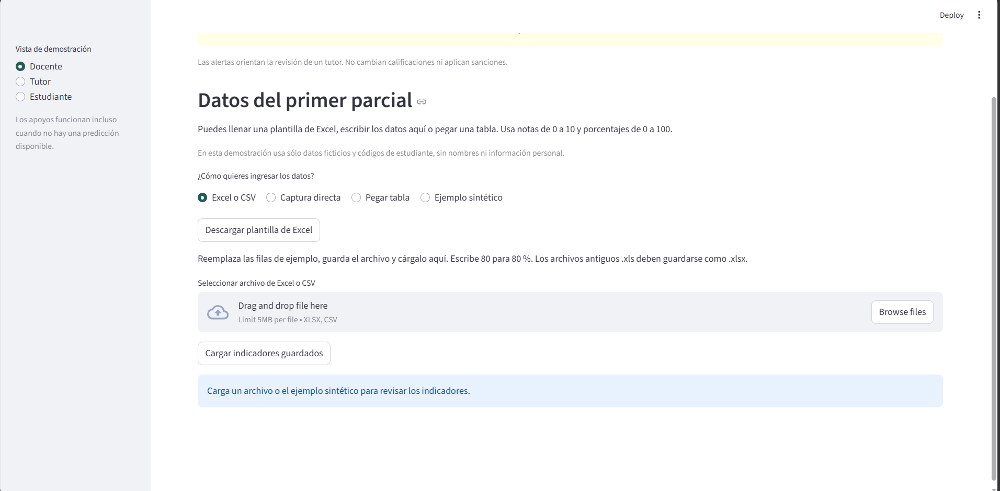
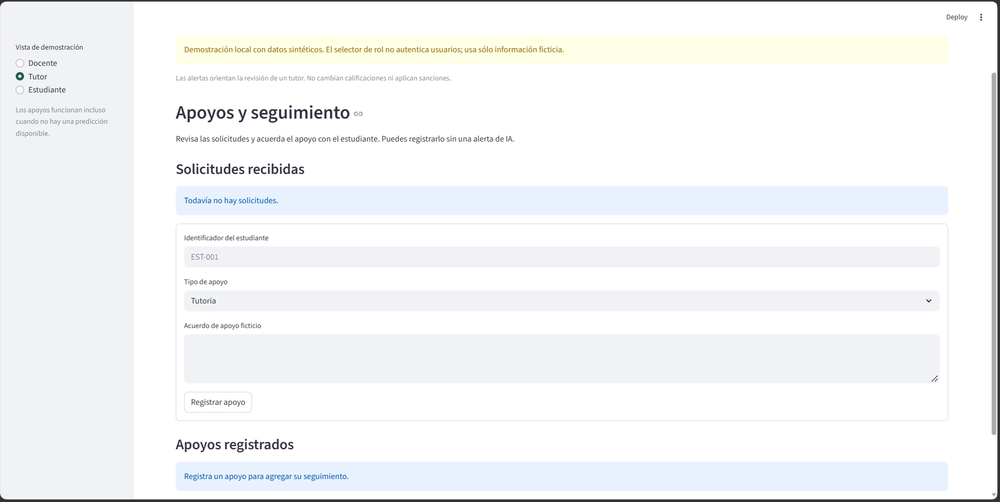
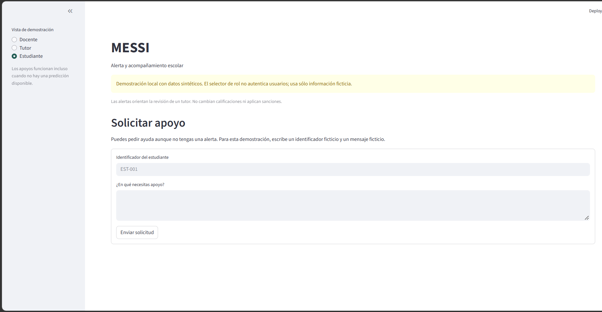

# Guía de la Interfaz y Revisión de Flujos (Evidencia Salomón)

Esta guía documenta el uso de la interfaz de MESSI para los tres roles demostrativos: Docente, Tutor y Estudiante.
Las pruebas de recorrido verifican que las entradas, mensajes de ayuda y procesos persistan correctamente en MySQL.

## 1. Rol Docente: Carga de indicadores y cálculo de riesgo
El docente es responsable de ingresar los indicadores de sus grupos para el periodo (actualmente `primer_parcial`) y generar las estimaciones de alerta sintéticas si el modelo está disponible.

**Pasos documentados:**
1. **Ingreso a la aplicación:** Abre la app y en el menú lateral selecciona el rol **Docente**.
2. **Método de carga:** Selecciona la pestaña **Ejemplo sintético** (para cargar los 8 registros de demostración). Alternativamente, puedes usar Captura Directa, CSV/Excel o Pegar Tabla. 
3. **Carga y validación:** Pulsa "Cargar ejemplo sintético". La interfaz validará que el código de estudiante, la nota, el porcentaje de asistencia y las tareas estén en los rangos correctos (0-10 para notas, 0-100 para porcentajes).
4. **Guardar en Base de Datos:** Pulsa el botón **"Guardar indicadores"**. La interfaz te mostrará un mensaje de éxito cuando los datos se aseguren en MySQL.
5. **Cálculo de demostración:** Si ejecutaste el entrenamiento, pulsa **"Calcular riesgo de demostración"**. El modelo evaluará el riesgo de los estudiantes, asignando una alerta a quienes superen el umbral sintético.

**Captura de evidencia (Docente):**
*(Captura proporcionada)*

---

## 2. Rol Tutor: Revisión y Seguimiento
El tutor analiza los indicadores guardados por los docentes y documenta los apoyos brindados a los estudiantes (haya alerta o no).

**Pasos documentados:**
1. **Ingreso:** En el menú lateral, cambia el rol a **Tutor**.
2. **Revisión de Casos:** Utiliza la sección "Cargar indicadores guardados" para consultar a los estudiantes. Aparecerá la lista con las predicciones del sistema.
3. **Registrar Apoyo:**
   - Escribe el código del estudiante (Ej: `EST-001`).
   - Selecciona el tipo de apoyo (Ej: *Asesoría académica* o *Apoyo psicosocial*).
   - Escribe las notas de seguimiento y marca el estado ("En seguimiento" o "Cerrado").
4. **Confirmación:** Pulsa "Guardar seguimiento". La información se enlazará al estudiante en la base de datos MySQL.

**Captura de evidencia (Tutor):**
*(Captura proporcionada)*

---

## 3. Rol Estudiante: Solicitud proactiva de ayuda
Los estudiantes pueden acceder a un formulario para pedir apoyo de manera autónoma, sin depender de que un modelo matemático active una alerta.

**Pasos documentados:**
1. **Ingreso:** En el menú lateral, selecciona **Estudiante**.
2. **Formulario:** Ingresa un código de estudiante (Ej: `EST-007`) y describe brevemente el motivo de la solicitud de apoyo.
3. **Envío:** Pulsa "Enviar solicitud". El sistema confirmará su registro en MySQL y la solicitud aparecerá disponible en la vista del Tutor.

**Captura de evidencia (Estudiante):**
*(Captura proporcionada)*

---
*Documento preparado por: Salomón Alvarez Gomez (Responsable de Documentación y Guía de Interfaz).*
