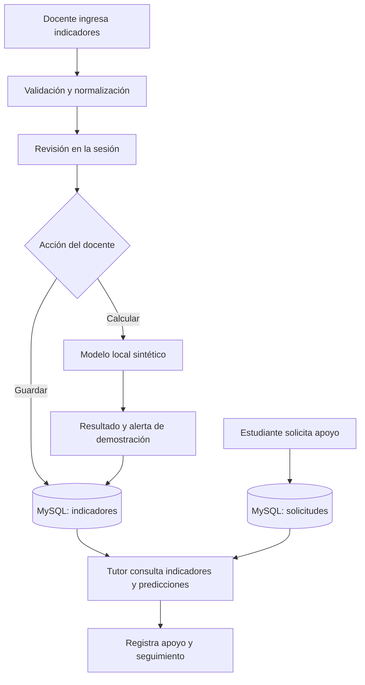

# Funcionalidad del proyecto MESSI

## Propósito

MESSI es un prototipo local para organizar indicadores escolares del primer
parcial y facilitar el acompañamiento entre docentes, tutores y estudiantes.
Permite revisar indicadores, calcular una alerta de demostración, registrar
solicitudes de apoyo y documentar el seguimiento acordado.

La versión actual es una demostración con datos sintéticos. El selector de rol
de la interfaz no autentica personas ni aplica permisos por usuario. No se deben
cargar nombres, expedientes ni datos reales de estudiantes. Una alerta es una
señal para revisión humana: no modifica calificaciones ni aplica sanciones.

## Recorrido general



La aplicación se ejecuta con Streamlit. Los datos se mantienen en la sesión de
la interfaz mientras se trabaja; guardar indicadores o calcular una predicción
intenta persistirlos en MySQL. Si una operación de base de datos falla, la
aplicación informa el error y conserva en la sesión los datos o el resultado
que ya se había calculado.

## Funciones por rol

### Docente

El docente puede cargar indicadores de cuatro maneras:

- **Excel o CSV:** carga un `.xlsx` o `.csv` con código del estudiante, nota,
  asistencia y tareas entregadas. También puede descargar la plantilla Excel.
- **Captura directa:** agrega estudiantes individualmente, ingresando
  porcentajes o cantidades registradas. En el modo de cantidades, el sistema
  calcula asistencia y tareas entregadas como porcentajes.
- **Pegar tabla:** pega filas desde una hoja de cálculo, con tabuladores o punto
  y coma como separador. Se admite coma decimal en esta modalidad.
- **Ejemplo sintético:** carga ocho registros ficticios incluidos en el proyecto.

Después de validar los registros, puede revisarlos, guardarlos para el periodo
`primer_parcial`, recuperar indicadores guardados o calcular la demostración de
riesgo. La predicción sólo se conserva en MySQL si la operación de guardado
termina correctamente. También puede descargar un CSV de reporte con los
indicadores y resultados de demostración.

### Tutor

El tutor puede consultar solicitudes recibidas, indicadores guardados y
predicciones disponibles. Puede registrar un apoyo para un estudiante aunque
no exista una alerta, seleccionar su tipo y mantenerlo como pendiente, en
seguimiento o cerrado. Cada seguimiento guarda una nota y el estado actualizado
del apoyo.

### Estudiante

El estudiante puede registrar una solicitud usando un identificador ficticio y
un mensaje. La solicitud no depende de una predicción ni de una alerta. En esta
versión, el flujo es demostrativo y no constituye una cuenta personal ni un
canal privado autenticado.

## Datos y validación

El contrato de indicadores contiene cuatro campos:

| Campo | Uso | Rango o formato |
| --- | --- | --- |
| `id_estudiante` | Código anónimo para identificar el registro | `EST-` seguido de 3 a 8 dígitos |
| `nota_parcial` | Nota del primer parcial | 0 a 10 |
| `asistencia` | Porcentaje de asistencia | 0 a 100 |
| `tareas_entregadas` | Porcentaje de tareas entregadas | 0 a 100 |

Los códigos deben ser únicos dentro de cada lista. Excel, CSV y las tablas
pegadas reciben porcentajes de 0 a 100; la captura por cantidades los calcula a
partir de asistencias/sesiones y tareas entregadas/solicitadas. Los códigos
generados automáticamente son temporales y no enlazan de forma fiable listas
distintas.

La validación rechaza campos faltantes o adicionales, IDs inválidos o
duplicados, valores no numéricos o fuera de rango y entradas vacías. Los CSV
usan UTF-8, punto decimal y un máximo de 5 MB y 10,000 filas. Los libros Excel
deben ser `.xlsx`; las fórmulas se rechazan. La etiqueta `resultado_final` sólo
pertenece al conjunto de entrenamiento y no se admite como dato de inferencia.

Los archivos incluidos en `data/synthetic/` son ficticios: hay ocho filas para
la demostración de carga y 240 para entrenar. El generador crea las variables y
la etiqueta mediante una fórmula artificial con ruido. Por ello, las métricas
del modelo sólo describen su comportamiento sobre esa simulación; no acreditan
precisión, equidad ni utilidad educativa con estudiantes reales.

## Predicción de demostración

La predicción es opcional y requiere un artefacto local, generado con
`scripts/train_demo.py` o `ENTRENAR_DEMO.bat`. El entrenamiento compara una
regla basada en nota, regresión logística y una red MLP de ocho neuronas. Divide
los datos sintéticos en entrenamiento, validación y prueba antes de ajustar el
escalador; el modelo de inferencia recibe únicamente nota, asistencia y tareas.

La interfaz muestra una puntuación entre 0 y 1 y activa la alerta al alcanzar
el umbral fijo de 0.5. Esa puntuación no está calibrada como probabilidad real y
el umbral no ha sido validado en una escuela. El modelo se almacena localmente
en `models/` y se comprueba contra metadatos y un hash antes de cargarse. Si no
existe o no puede utilizarse, los indicadores siguen disponibles y la app
informa que la predicción está pendiente o no disponible.

## Almacenamiento

MySQL es el almacenamiento del runtime y requiere inicialización explícita. El
esquema relacional conserva:

- estudiantes identificados por un código anónimo;
- indicadores por estudiante y periodo;
- predicciones asociadas a los indicadores;
- solicitudes, apoyos y seguimientos.

Las solicitudes y notas de seguimiento no son variables del modelo. Cambiar los
indicadores invalida la predicción anterior asociada a esos valores. SQLite se
mantiene como almacenamiento legado para migración y pruebas; no es el motor
principal del runtime actual. La creación del esquema se ejecuta por separado
con `scripts/init_database.py`, no desde las pantallas de la app.

## Estructura del código

| Ruta | Responsabilidad |
| --- | --- |
| `app.py` | Interfaz Streamlit y flujos por rol |
| `src/messi/data.py` | Contrato, validación y lectura de datos |
| `src/messi/model.py` | Comprobación del artefacto e inferencia |
| `src/messi/database.py` | Configuración, conexiones y transacciones MySQL |
| `src/messi/mysql_storage.py` | Operaciones de persistencia del runtime |
| `src/messi/esquema_mysql.sql` | Tablas, relaciones y restricciones de MySQL |
| `src/messi/storage.py` | Almacenamiento SQLite legado y validaciones compartidas |
| `src/messi/migration.py` | Migración explícita desde SQLite legado |
| `scripts/` | Inicialización, migración, generación y entrenamiento sintético |
| `data/synthetic/` | Plantilla y conjuntos de datos ficticios |
| `data/private/` | Archivos privados locales, excluidos de Git |
| `models/` | Artefactos locales de entrenamiento, excluidos de Git |
| `tests/` | Pruebas de validación, interfaz, modelo y almacenamiento |

## Requisitos y verificación

El proyecto requiere Python 3.11 a 3.13, dependencias instaladas y MySQL 8.0.16
o posterior para persistencia. La guía de instalación y configuración está en
el [README del proyecto](../README.md); los detalles de configuración de MySQL
están en [Base de datos](base_de_datos.md).

La suite puede ejecutarse desde la raíz del repositorio con:

```powershell
py -3.13 -m unittest discover -s tests -v
```

Las pruebas con dobles de conexión verifican contratos de software, pero no
sustituyen una prueba contra el servidor MySQL de la instalación. La conexión,
el esquema local y los permisos deben comprobarse por separado.